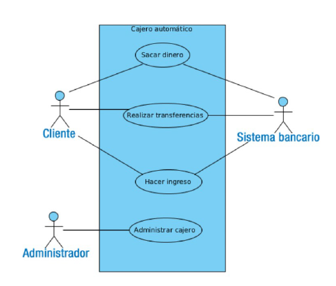
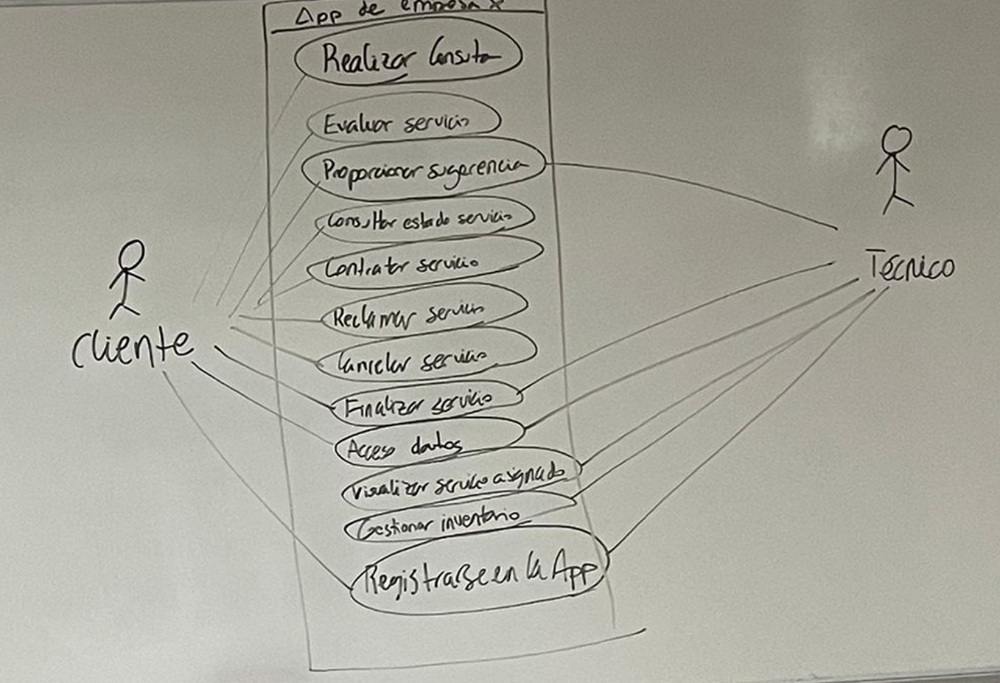
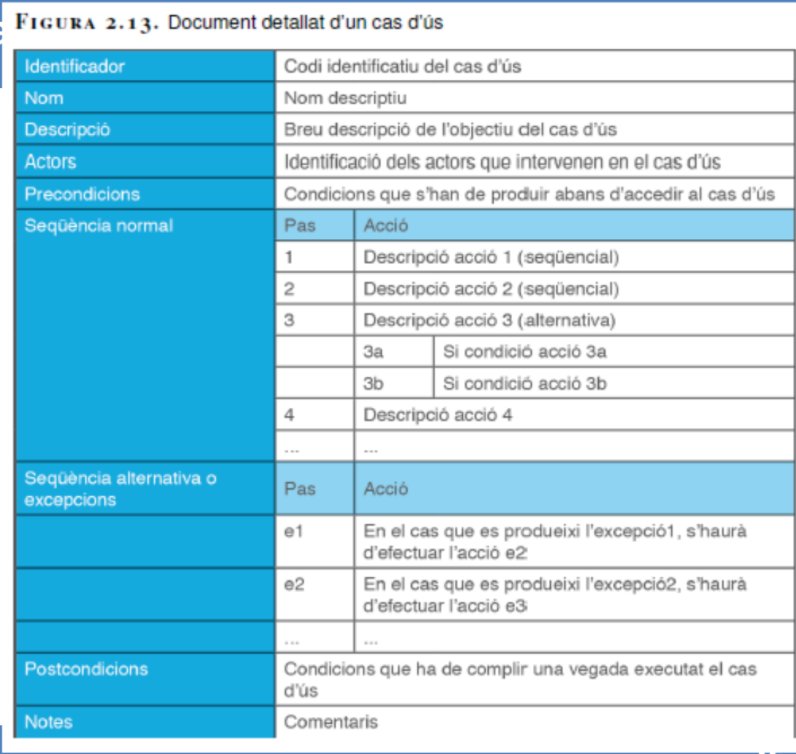
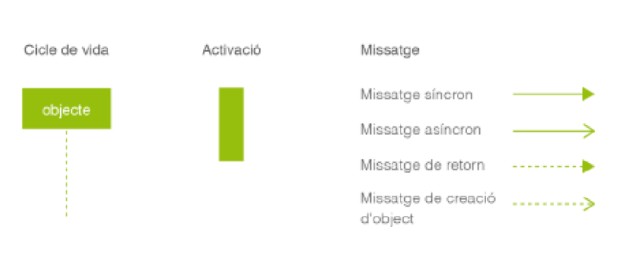
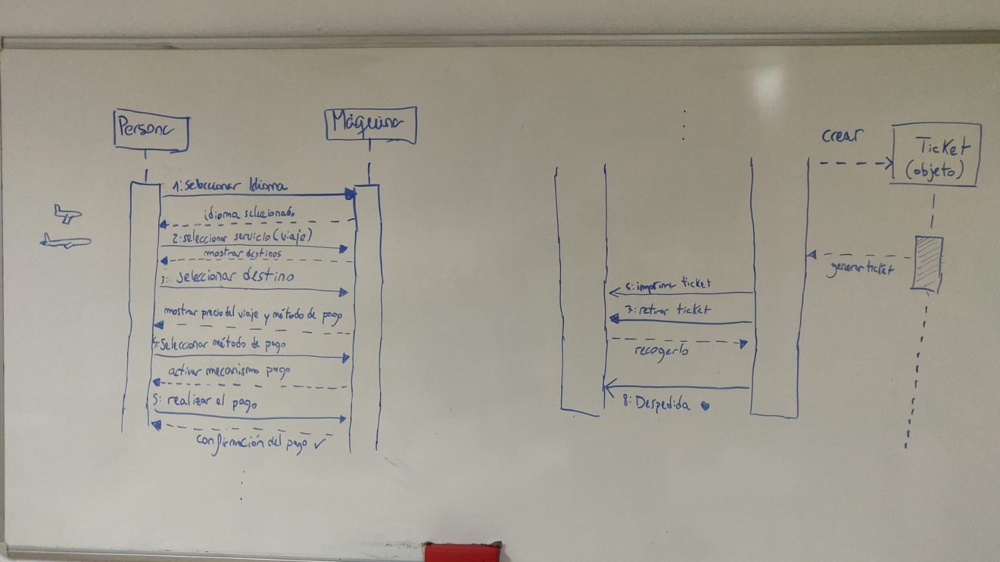

# 📚 **EXAMEN T.3 ENTORNOS DE DESARROLLO**

## **CONTENIDO :**
- Partes Interesadas + Nomenclatura.
- Requisitos Funcionales 

**OPTATIVIDAD**
- Casos de uso + tabla
- Diagrama secuencia
- Teoria

---

## **1.Partes interesadas**

### **Nomenclatura:**

Cliente: **RF_Cliente_XX** 
Empresario: **RF_Empresario_XX**

## **2.Escribir requisitos funcionales de las partes interesadas.**

### ***Sintaxis***

**RF_Cliente_01_Servicio**
- Contratar servicio
- Algo mas

**RF_Empresario_06_Factura**
- Listar
- Facturar
>EJEMPLO

## **3.Diagrama de casos de uso**

Identifica los distintos comportamientos de un sistema desde el punto de vista de sus interacciones
con el mundo exterior y describe determinadas relaciones entre estos comportamientos.

Se utiliza un punto de vista del usuario final para elaborar los diagramas de casos de uso.

En un diagrama de casos de uso se utilizan:
- Actores: que puede ser una persona, un sistema o un dispositivo.
- Casos de uso: que suelen ser verbos o acciones en infinitivo, señalados dentro de una forma
ovalada.
- Límite del sistema: contiene los casos de uso y el nombre del sistema que se representa.
- Líneas: que se utilizan para asociar, extender, incluir o generalizar.
> - Asociación: una línea.
> - Extensión e inclusión: una línea con punta hueca donde arriba de la cual se indica si extiende o incluye.
> - Generalización: una línea con punta hueca.

>EJEMPLO

**Rellenar documento detallado de diagrama de casos de uso.**

## **4.Diagrama de secuencia**
Describe las interacciones entre un grupo de objetos mostrando de forma secuencial los envíos de
mensajes entre objetos.

Los diagramas de secuencia se constituyen de:

Los tipos de mensajes tienen la siguiente descripción:
- **Síncronos:**se utilizan cuando el objeto espera la respuesta de este mensaje antes de
continuar con su trabajo.
- **Mensajes de retorno:** se usan cuando un objeto devuelve una respuesta de un mensaje
síncrono.
- **Asíncronos:** se utilizan cuando el objeto no espera la respuesta de este mensaje antes de
continuar.
- **Mensajes de creación de objeto:** se usan cuando se crea un nuevo objeto.

>EJEMPLO
