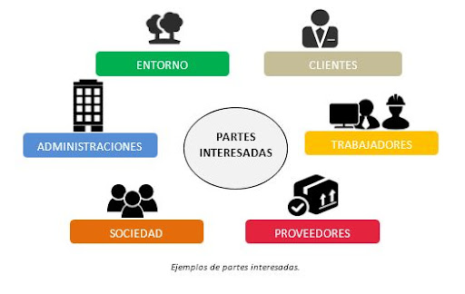
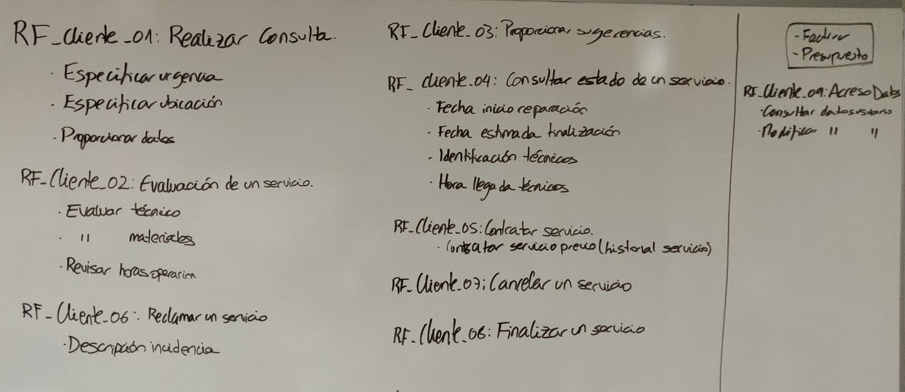

# 📚 **EXAMEN T.3 ENTORNOS DE DESARROLLO**

## **CONTENIDO :**
- Partes Interesadas + Nomenclatura.
- Requisitos Funcionales 

**OPTATIVIDAD**
- Casos de uso + tabla
- Diagrama secuencia
- Teoria

---

## **1.Partes interesadas**

### **Nomenclatura:**

Cliente: **RF_Cliente_XX** 
Empresario: **RF_Empresario_XX**

## **2.Escribir requisitos funcionales de las partes interesadas.**

### ***Sintaxis***

**RF_Cliente_01_Servicio**
- Contratar servicio
- Algo mas

**RF_Empresario_06_Factura**
- Listar
- Facturar
>EJEMPLO

